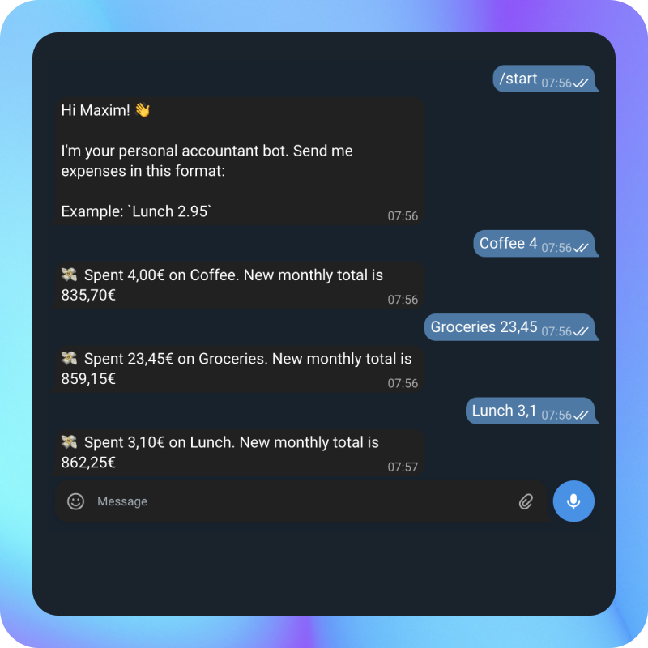
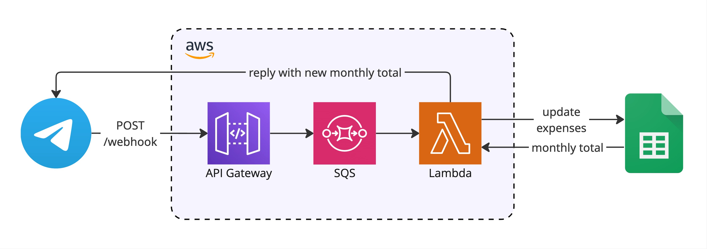

<div align="center">
  
  <h1>Accountant Bot</h1>
  <a href="https://github.com/hagelstam/accountant-bot/deployments/prod">
    
  </a>
  <a href="https://goreportcard.com/report/hagelstam/accountant-bot">
    
  </a>
  <a href="https://opensource.org/license/mit">
    
  </a>
</div>

Telegram bot that processes expense messages and updates my personal budget tracking spreadsheet.

## Screenshot



## Architecture



1. Telegram sends updates to the `/webhook` endpoint
2. API Gateway invokes a Lambda
3. Lambda updates a Google Sheets spreadsheet and sends a response back to Telegram

## Prerequisites

- [mise](https://mise.jdx.dev/)
- AWS account
- Docker
- Telegram bot token (from [@BotFather](https://t.me/botfather))
- Google Service account credentials with Sheets API access

## Development

Install development tools:

```bash
mise install
```

Available commands:

```bash
# Run tests
make test

# Run linting
make lint

# Format code
make fmt

# Build binary
make build
```

## Configuration

The following environment variables are required:

`TELEGRAM_BOT_TOKEN` - Your Telegram bot token from BotFather

`GOOGLE_CREDENTIALS_JSON` - Google Service Account credentials (JSON string)

`GOOGLE_SPREADSHEET_ID` - ID of your Google Sheets expense tracker

`LOGGING_LEVEL` - Logging verbosity (DEBUG, INFO, WARN, ERROR)

## Deployment

### Infrastructure setup

1. [Configure AWS CLI](https://docs.aws.amazon.com/cli/latest/userguide/cli-configure-sso.html)

2. Build and push Docker image:

```bash
# Set variables
AWS_ACCOUNT_ID=$(aws sts get-caller-identity --query Account --output text)
AWS_REGION=$(aws configure get region)
ECR_REPOSITORY="accountant-bot-prod"
IMAGE_TAG="latest"

# Login to ECR
aws ecr get-login-password --region $AWS_REGION | docker login --username AWS --password-stdin $AWS_ACCOUNT_ID.dkr.ecr.$AWS_REGION.amazonaws.com

# Build Docker image for ARM64
docker buildx build --platform linux/arm64 -t $ECR_REPOSITORY:$IMAGE_TAG .

# Tag image for ECR
docker tag $ECR_REPOSITORY:$IMAGE_TAG $AWS_ACCOUNT_ID.dkr.ecr.$AWS_REGION.amazonaws.com/$ECR_REPOSITORY:$IMAGE_TAG

# Push to ECR
docker push $AWS_ACCOUNT_ID.dkr.ecr.$AWS_REGION.amazonaws.com/$ECR_REPOSITORY:$IMAGE_TAG
```

3. Navigate to infra directory:

```bash
cd infra/env/prod
```

4. Create `terraform.tfvars` with your configuration:

```hcl
telegram_bot_token      = "your-telegram-bot-token"
google_credentials_json = "your-google-credentials-json"
google_spreadsheet_id   = "your-spreadsheet-id"
image_tag              = "latest"
```

5. Deploy infrastructure:

```bash
terraform init
terraform plan
terraform apply
```

6. Configure your Telegram bot webhook to point to the API Gateway URL:

```bash
curl -X POST "https://api.telegram.org/bot<BOT_TOKEN>/setWebhook" -d "url=<API_GATEWAY_URL>/prod/webhook"
```

## Built with

- [Go](https://go.dev/)
- [Terraform](https://developer.hashicorp.com/terraform/)
- [Google Sheets API](https://developers.google.com/sheets/api)
- [AWS Lambda](https://aws.amazon.com/lambda/)
- [AWS API Gateway](https://aws.amazon.com/api-gateway/)
- [AWS ECR](https://aws.amazon.com/ecr/)

## License

This project is licensed under the terms of the [MIT](https://choosealicense.com/licenses/mit/) license.
